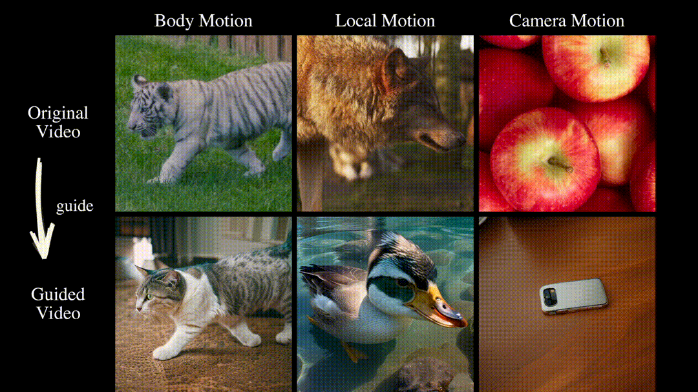

# MotionClone
This repository is the official implementation of [MotionClone](https://arxiv.org/abs/2307.04725). It is a training-free framework that enables motion cloning from a reference video to control text-to-video generation.

Click for the full abstract of MotionClone

> We propose MotionClone, a training-free framework that enables motion cloning from a reference video to control text-to-video generation. We employ temporal attention in video inversion to represent the motions in the reference video and introduce primary temporal-attention guidance to mitigate the influence of noisy or very subtle motions within the attention weights. Furthermore, to assist the generation model in synthesizing reasonable spatial relationships and enhance its prompt-following capability, we propose a location-aware semantic guidance mechanism that leverages the coarse location of the foreground from the reference video and original classifier-free guidance features to guide the video generation.

**[MotionClone: Training-Free Motion Cloning for Controllable Video Generation](https://arxiv.org/abs/2307.04725)** 
 
[Pengyang Ling*](https://github.com/LPengYang/),
[Jiazi Bu*](https://github.com/Bujiazi/),
[Pan Zhang](https://panzhang0212.github.io/),
[Xiaoyi Dong](https://scholar.google.com/citations?user=FscToE0AAAAJ&hl=en/),
[Yuhang Zang](https://yuhangzang.github.io/),
[Tong Wu](https://wutong16.github.io/),
[Huaian Chen](https://scholar.google.com.hk/citations?hl=zh-CN&user=D6ol9XkAAAAJ),
[Jiaqi Wang†](https://myownskyw7.github.io/),
[Yi Jin†](https://scholar.google.ca/citations?hl=en&user=mAJ1dCYAAAAJ)
(*Equally Contribution)(†Corresponding Author)

<!-- [Arxiv Report](https://arxiv.org/abs/2307.04725) | [Project Page](https://animatediff.github.io/) -->

## 🏗️ Todo
- [ ] Release Gradio demo
- [ ] Release the MotionClone code

## 🚀 Method Overview
